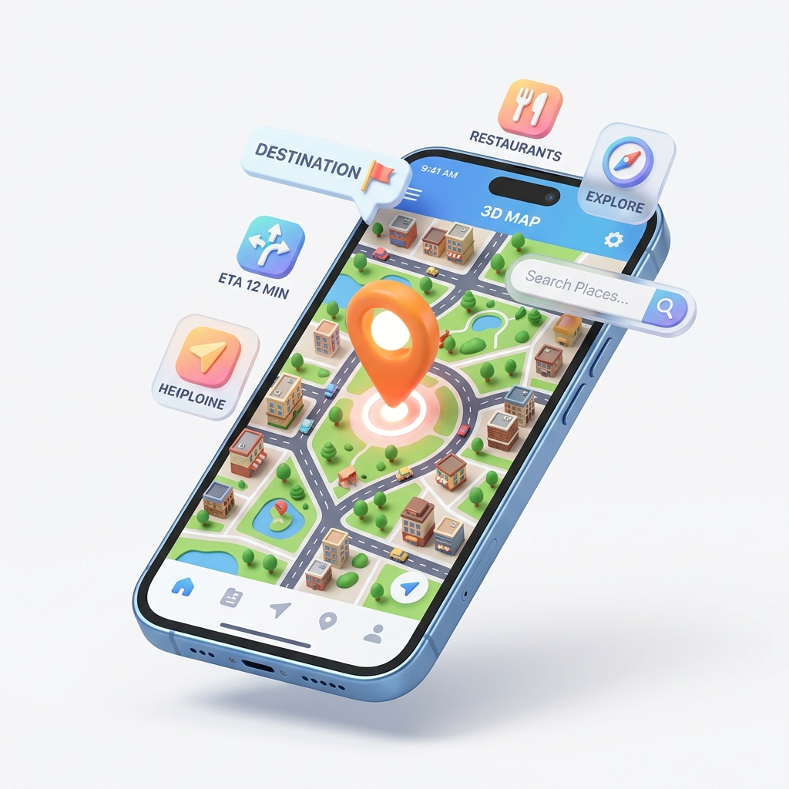

# Trimzy India's Smartest Barber Booking Platform 

[](https://firebase.google.com/)
[](https://developer.mozilla.org/en-US/docs/Web/JavaScript)
[](https://developer.mozilla.org/en-US/docs/Web/CSS)
[](https://developer.mozilla.org/en-US/docs/Web/HTML)

**Trimzy** is a modern, high end barber booking platform designed to eliminate waiting times in Indian barbershops. Based in Bhubaneswar, it connects customers with premium barbers for both shop visits and doorstep services

---

## Key Features

### For Customers
- **Instant Booking**: Secure a slot in under 60 seconds
- **Doorstep Service**: Get a professional haircut in the comfort of your home
- **Virtual Queue**: Real time updates on your wait time so you never waste a minute
- **Verified Reviews**: Authentic feedback from the community to help you choose the best barber
- **Secure Payments**: Integrated with Razorpay for seamless UPI, Card, and Netbanking transactions

### For Barbers
- **Professional Dashboard**: Manage appointments, track revenue, and analyze growth
- **Zero Commission**: A platform built for barbers, ensuring they keep 100% of their earnings
- **Smart Scheduling**: Avoid double bookings and fill empty slots automatically
- **Direct Communication**: Automated SMS and email notifications via Brevo

---

## Technology Stack

- **Frontend**: Vanilla HTML5, CSS3 (Modern Glassmorphism UI), and Modular JavaScript
- **Backend/Database**: Firebase Firestore (NoSQL) & Firebase Authentication
- **Payments**: Razorpay API Integration
- **Messaging**: Brevo API for transactional emails and notifications
- **Hosting**: Firebase Hosting

---

##  Project Structure

```text
├── assets/             # Images, videos, and branding assets
├── css/                # Externalized CSS modules for each page
├── js/                 # Modularized JavaScript logic
├── shared.js           # Core utility functions used across the app
├── firebase.js         # Firebase configuration and initialization
├── index.html          # Main landing page
├── app.html            # Customer booking application
├── barber-dashboard.html # Secure portal for partner barbers
└── admin.html          # Internal management dashboard
```

---

##  Getting Started

### Prerequisites
- A modern web browser (Chrome, Safari, or Firefox)
- A local web server (e.g., VS Code Live Server) to handle ES6 Modules

### Installation
1. Clone the repository:
   ```bash
   git clone https://github.com/Prashantkumar2611/trimzy.git
   ```
2. Navigate to the project directory:
   ```bash
   cd trimzy
   ```
3. Open the project with a local server:
   - If using VS Code, right-click `index.html` and select **"Open with Live Server"**
   - Or use `npx http-server` in the terminal

---

## 📸 Visuals

| Home Page | Booking App | Barber Dashboard |
|-----------|-------------|------------------|
|  |  |  |

---

##  Contributing

We welcome contributions! Please feel free to submit a Pull Request or open an issue for any bugs or feature requests

## 📄 License

This project is licensed under the MIT License - see the LICENSE file for details

---

Built with ♥ in **Bhubaneswar, India**
